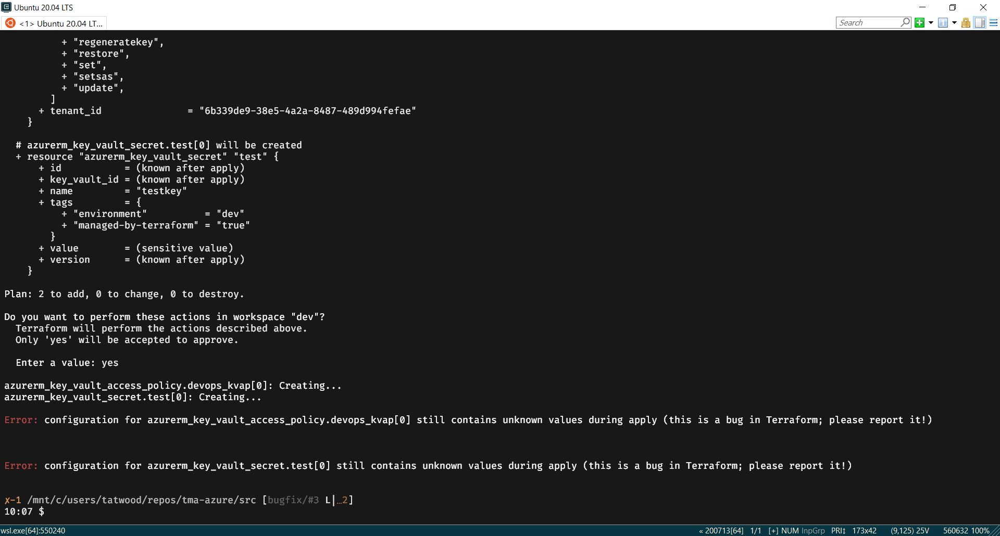

# Terraform AzureRM Key Vault Errors Replication

## Environment Specifications

Terraform v0.12.29
AzureRM provider 2.20.0

Error can be replicated when running from either PowerShell Core 7.0.3 on Windows 10 2004 or in Ubuntu 20.04 (via WSL 2.0)

## Problem Description

When attempting to create any Azure key vault related resource (key vault access policy, key vault secret, key vault certificate, etc.), the Terraform apply responds stating "Error: configuration for [resource] still contains unknown values during apply (this is a bug in Terraform; please report it!)

A screenshot of the error is here:

This repository contains Terraform code to replicate the error.

## Instructions to run this repository

1.  Make sure the terraform.tfvars is populated with the subscription ID.
2.  Setup the Terraform backend in backend.tf
  